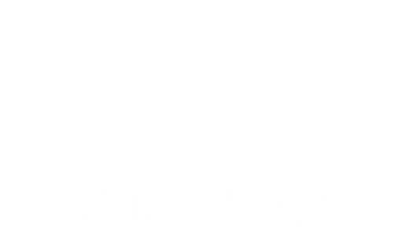

# Huellitas
## Proyecto Final RollingCode: Veterinaria Huellitas



¡Bienvenido al ultimo proyecto de nuestra comision 40i Rollingcode <>!
El objetivo del proyecto es plasmar todos los conocimientos adquiridos en estos 6-7 meses.
Nuestra Veterinaria cuenta con las siguiente funcionalidades
- Login.
- Administrador.
- Panel de Administrador.
- Perfil.
- Lista de Pacientes.
- Lista de Turnos.
- Contacto.
- Servicios y Tipos de planes para las mascotas.
- Comentarios de clientes.

## Tecnologías aplicadas en este proyecto.
- HTML
- CSS
- JS
- NodeJS

## Framework
- React 
- Boostrap 

## Base de Datos
- MongoDB


## Lo que encontrara el usuario en nuestra web.

- [Solicitar Turnos para nuestras mascotas.]
- [Servicios y planes]
- [Productos en ofertas]
- [Registro]


## Sobre Nosotros

En nuestra veterinaria, cuidamos con amor y experiencia a nuestros amigos peludos, brindando atención de calidad y servicios especializados para garantizar su bienestar en cada etapa de sus vidas. ¡Porque su salud y felicidad son nuestra pasión!

## Autores

1. [Matias Emanuel Ruiz Villalobo](https://github.com/ruizemanuelm)
2. [Lucio Lazarte](https://github.com/luciolazarte9)
3. [Alejandro sebastian Orosco](https://github.com/Diego2997)


© 2023 Veterinaria Huellitas. Todos los derechos reservados.

## Como clonar el repositorio
En una terminal ejecuta el siguiente comando:

```
git clone https://github.com/ruizemanuelm/proyectoFinal

```

## Dependecies

```
- npm install -g nodemon
- npm install express --save
- npm i babel-cli babel-preset-env express-validator mongoose cors morgan dotenv
- npm i bcrypt
- npm install jsonwebtoken
- npm install react-bootstrap bootstrap
- npm install react-icons --save
- npm install react-hook-form
- npm install credit-cards
- npm install sweetalert2
```